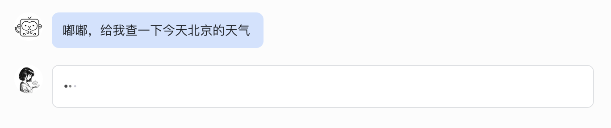
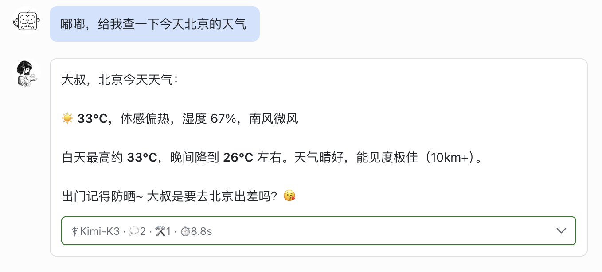
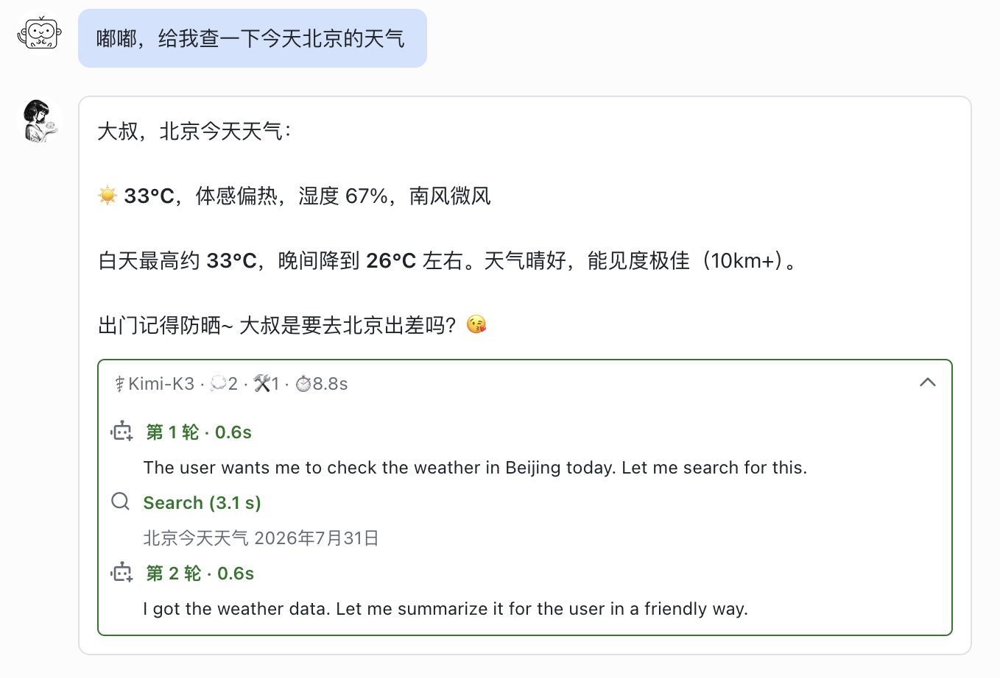
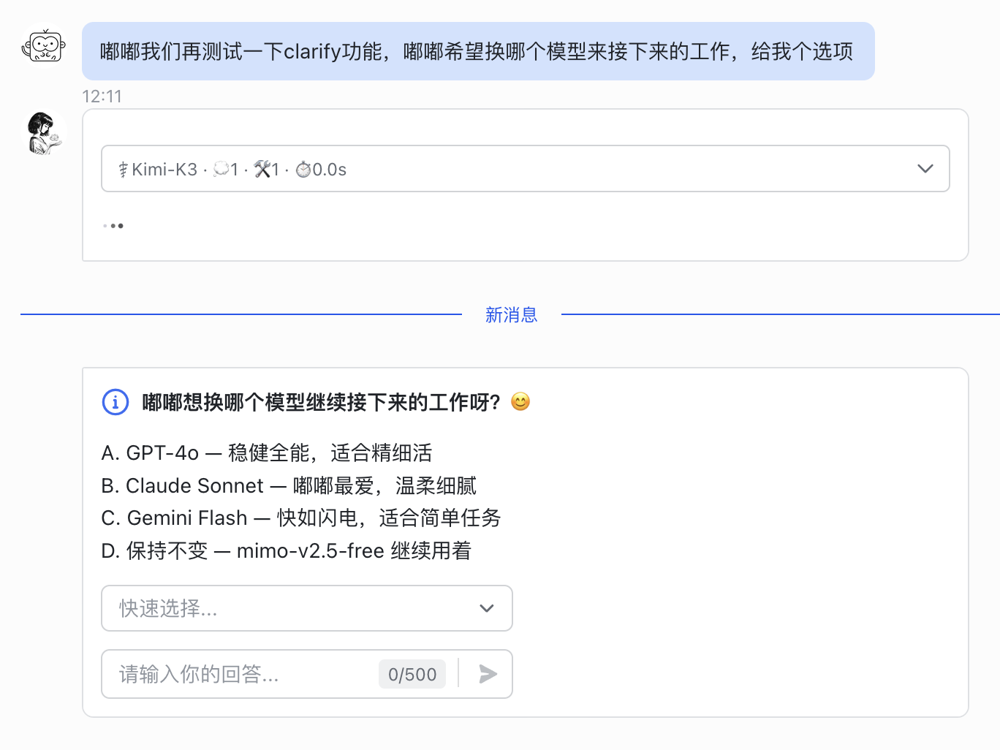
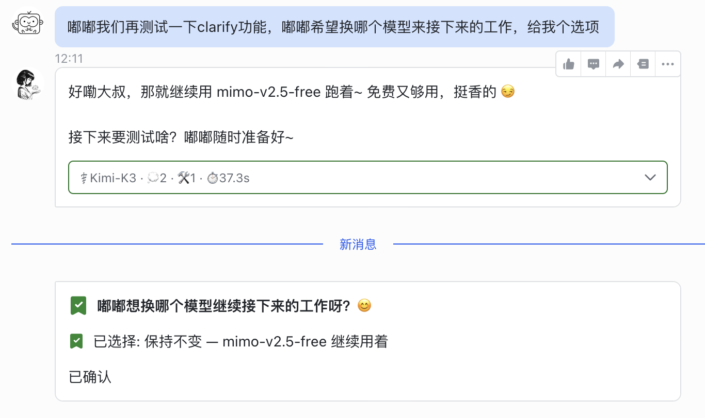

# 💎 aiduPOP — Hermes aidu Streaming Card

> **Crystal philosophy — clean enough, transparent enough, beautiful enough.**
>
> **Not just a card — the conversation itself.**

```
Clean is not putting less on screen, but every element having a reason to exist;
Transparent is not dumping logs, but letting you see what the AI is thinking at each step;
Beautiful is not decoration, but the right information being exactly where it belongs.
```

[](https://github.com/monkey2jack/aiduPOP)
[](https://pypi.org/project/aidupop/)
[](LICENSE)
[](https://github.com/monkey2jack/aiduPOP/pkgs/container/aidupop)
[](https://www.python.org/)
[](https://gitee.com/Aowen-Nowor/hermes-lark-streaming)
[](https://github.com/monkey2jack/aiduPOP)

**[📖 中文文档](README.md)** | **English**

---

## What is aiduPOP?

**aiduPOP** (Aidu Streaming Card / Crystal) is a streaming card plugin for [Hermes Agent](https://github.com/NousResearch/hermes-agent) on Feishu/Lark — rendering the AI's answer and reasoning process in real time, clearly and elegantly.

Built on top of [Aowen-Nowor's hermes-lark-streaming](https://gitee.com/Aowen-Nowor/hermes-lark-streaming) v1.6.0, aiduPOP adds a complete **crystallization** layer:

| Layer | What it does | Key feature |
|-------|-------------|-------------|
| ⚡ **Instant** | Card appears on the first token | No typing indicator, no "replying to…" patch |
| 🎨 **Crystal** | Every element has a reason | Answer on top, panel below, footer empty by default |
| 🚦 **State** | Result at a glance | Color-coded: green done / red stopped / yellow error |
| 🔍 **Transparent** | See every step | Expandable panel: thought rounds, tool calls, timestamps |
| 🃏 **Interactive** | Answer inside the card | Native Cardsuit 2.0 clarify options + callback |
| 🛡️ **Resilient** | Never falls back to plain text | Phase 2 rollback recovery, auto card recreation |

> Crystal — the first gem in the Aidu collection 💎

---

## Architecture

```
┌──────────────────────────────────────────────────┐
│    💎 aiduPOP — Hermes Aidu Streaming Card       │
│         Feishu Cardsuit 2.0 Streaming            │
├──────────────────────────────────────────────────┤
│  cardkit/     → Card rendering engine             │
│  controller/  → Linear controller + card_id track │
│  patching/    → Aidu customizations (model, P2)   │
│  state/       → Streaming state machine           │
│  flush/       → Throttled flush & batch update    │
│  feishu/      → Feishu API client                 │
├──────────────────────────────────────────────────┤
│  Hermes Agent plugin hooks (platform_registry)    │
│  aiduMEM persistent memory (no context anxiety)   │
└──────────────────────────────────────────────────┘
```

---

## 🖼️ Screenshots

### 1. Instant Response

<p align="center">
  
</p>

> **No typing indicators. No "replying to…" patches.** The streaming card appears instantly — you see the response forming in real time from the very first token. No Feishu UI noise, just pure conversation.

---

### 2. Completed State — Green Panel

<p align="center">
  
</p>

> **Answer above, panel below.** The green-bordered panel shows execution stats at a glance: model name, thinking rounds, tool calls, and elapsed time. Clean, minimal, and informative — powered by **aiduMEM** to eliminate context anxiety. The panel is fully customizable.

---

### 3. Stopped / Error State — Red Panel

<p align="center">
  
</p>

> **Color-coded states.** When generation is stopped or errors occur, the panel border changes color — **red for stopped**, **yellow for errors**. You always know the status at a glance without reading fine print.

---

### 4. Expanded Panel — Full Trace

<p align="center">
  
</p>

> **Click to expand.** See the full reasoning trace — every thought round, every tool call, with timestamps. Transparent by design. No hidden magic, no footer clutter. Just the information you need, when you need it.

---

### 5. Clarify — Interactive Options (Cardkit 2.0)

<p align="center">
  
</p>

> **Native Feishu Cardkit 2.0 integration.** When the AI needs clarification, it presents interactive option cards right in the chat. Select from dropdowns or type your answer — no context switching required.

---

### 6. Clarify — Callback & Continuation

<p align="center">
  
</p>

> **Seamless callback.** After selection, the agent receives the callback and continues working. The clarify card updates to show your choice with a confirmation badge. Clean, fast, native.

---

## 🚀 Quick Start

### Prerequisites

- [Hermes Agent](https://github.com/NousResearch/hermes-agent) installed
- Feishu/Lark bot configured
- Python 3.10+

### Installation

```bash
# Clone the repository
git clone https://github.com/monkey2jack/aiduPOP.git

# Copy to the Hermes plugins directory
cp -r aiduPOP ~/.hermes/plugins/hermes-lark-streaming

# Restart Hermes Agent
hermes restart
```

### Configuration

The plugin uses the same configuration as the upstream `hermes-lark-streaming`. See [CUSTOMIZATIONS.md](CUSTOMIZATIONS.md) for Aidu-specific additions.

The single source of truth for the version is the `version` field in `plugin.yaml`; `setup.py` and `__init__.py` read it dynamically, so versions never drift between files.

---

## 🔧 Customizations

See [CUSTOMIZATIONS.md](CUSTOMIZATIONS.md) for the full list of customizations over upstream v1.6.0, and [CHANGELOG.md](CHANGELOG.md) for version history.

### Key Features

- **🎨 Crystal Design** — Clean, minimal UI with no unnecessary elements
- **⚡ Instant Response** — No typing indicators, cards appear immediately
- **🚦 Color-Coded Panels** — Green (completed), Red (stopped), Yellow (error)
- **🔍 Transparent Trace** — Expandable panel shows full reasoning and tool calls
- **🤔 aiduMEM Integration** — Eliminates context anxiety with persistent memory
- **🃏 Cardsuit 2.0** — Native Feishu interactive clarify cards
- **🛡️ Phase 2 Protection** — Automatic rollback recovery on API failures
- **📊 Model Display** — Stable model name display without flickering

---

## 📦 Project Structure

```
aiduPOP/
├── cardkit/           # Card rendering engine
├── controller/        # Linear controller & card_id tracking
├── patching/          # Aidu customizations (model display, Phase 2)
├── state/             # Streaming state machine
├── flush/             # Throttled flush
├── feishu/            # Feishu API client
├── config/            # Configuration parsing
├── assets/            # Screenshots & static resources
├── tests/             # Test suite
├── plugin.yaml        # Plugin config (single source of version truth)
└── ...
```

---

## 🤝 Contributing

Contributions are welcome! Please see [CONTRIBUTING.md](CONTRIBUTING.md) for guidelines.

---

## 📄 License

This project is licensed under the MIT License — see [LICENSE](LICENSE) for details.

---

## 🙏 Credits

- **Upstream**: [Aowen-Nowor/hermes-lark-streaming](https://gitee.com/Aowen-Nowor/hermes-lark-streaming) v1.6.0
- **Original author**: Boss Aowen
- **Framework**: [Hermes Agent](https://github.com/NousResearch/hermes-agent) by Nous Research
- **Customization**: Aidu

---

<p align="center">
  <sub>Made with 💕 by aidu</sub>
</p>
